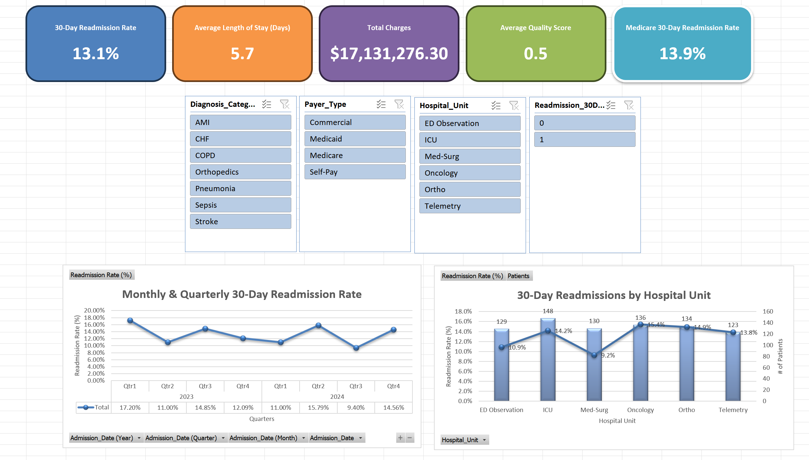

# Hospital Readmission & Quality Metrics Dashboard

## About
This project features an **interactive Excel dashboard** designed to track and analyze key hospital performance metrics, including:
- 30-Day Readmission Rates
- Average Length of Stay
- Total Charges
- Average Quality Scores
- Medicare-Specific Readmission Rates

It allows stakeholders to explore **diagnosis categories, payer types, and hospital units** using slicers, with dynamic visualizations to support decision-making and quality improvement.

---

## Preview

*Interactive Excel dashboard showing readmission rates, length of stay, charges, and unit-level analysis.*

---

## Key Metrics
- **30-Day Readmission Rate:** 13.1%
- **Average Length of Stay:** 5.7 days
- **Total Charges:** $17,131,276.30
- **Average Quality Score:** 0.5
- **Medicare 30-Day Readmission Rate:** 13.9%

---

## Features
- 📊 **Dynamic Charts** — Monthly, quarterly, and unit-level readmission trends  
- 📌 **Slicers** — Filter by diagnosis, payer type, and hospital unit  
- 📈 **Combo Charts** — Compare readmission rates and patient volumes  
- 📂 **Clean Data Design** — Built with advanced Excel formulas, pivot tables, and formatting best practices  

---

## How to Use
1. Download the file `hospital-readmission-quality-dashboard.xlsx`
2. Open in Microsoft Excel (Desktop version recommended for full interactivity)
3. Use slicers to filter by diagnosis, payer type, and hospital unit
4. Explore trends in readmission rates and quality metrics

---

## Skills Demonstrated
- Data Cleaning & Transformation  
- Advanced Excel Functions  
- Pivot Table Analysis  
- Interactive Dashboard Design  
- Healthcare Quality & Operations Analytics  

---

## File Structure

